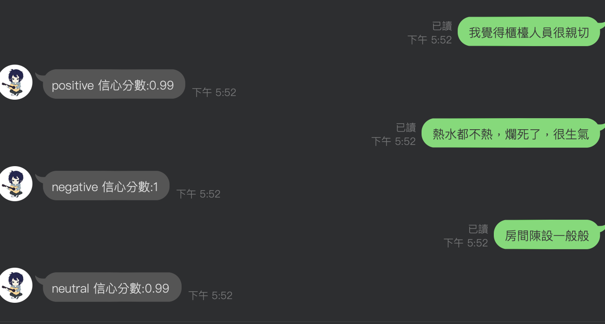

## HW4 :

### 執行解果照片：

##### 說明：
1. 在line 執行解果中, 我們可以看出當我們給他的 message 為'我覺得櫃檯人員很親切'時
linebot 會回傳給我們'positive' 且信心指數為0.99, 形容這個message皆為正面的.
2. 反之, 當我們給予linebot'熱水都不熱，爛死了，很生氣'時
linebot 會回傳給我們'negative' 且信心指數為 1, 形容這個 message 為負面的.
3. 而當我們傳給他 '房間陳設一般般' 這樣的message給他時,
他也會正確的回傳'neutral' 且信心指數為0.99, 形容這個 message 為中立的.
