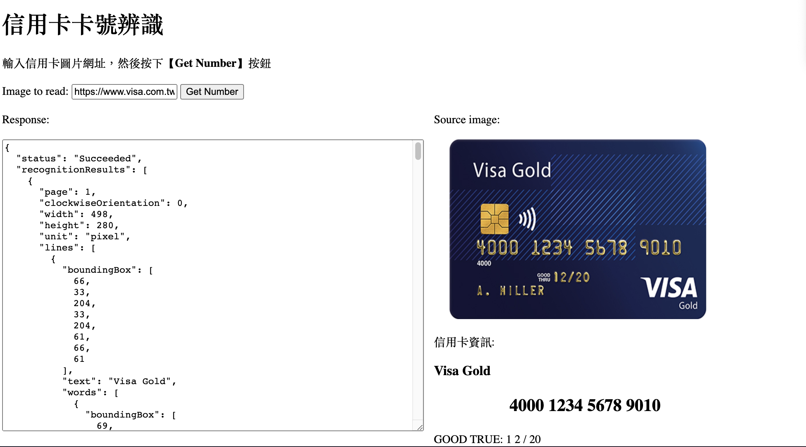

## HW5 :

### 執行解果照片：


##### 說明：
在原先 Azure 提供的信用卡辨識功能中
新增一些 show 的資料
讓使用這可以清楚看到上傳的信用卡內容資訊
包含信用卡卡片種類, 信用卡卡號, GOOD TRUE 等等

##### 程式碼說明：

``` html
<p>信用卡資訊: </p>
<h3 id="RecognitionName"></h3>
<p id="RecognitionCardNumber">XXXX XXXX XXXX XXXX</p>
<p id="RecognitionCVV"></p>
```
在index.html 中, 新增 "RecognitionName", "RecognitionCVV" 等資訊

``` js
$("#RecognitionCVV").text("GOOD TRUE:"+recognitionArray[3].text.replace(/[a-zA-Z]/g, ""));
$("#RecognitionName").text(recognitionArray[0].text);
```
在 main.js 中, 定義 "RecognitionName", "RecognitionCVV"
其中直得提到的是, 在定義 "RecognitionCVV" 時
因為內部會有其他掃描錯誤的英文字母
我用了正則表達式的字串處裡的方式, 來解決此一問題～
